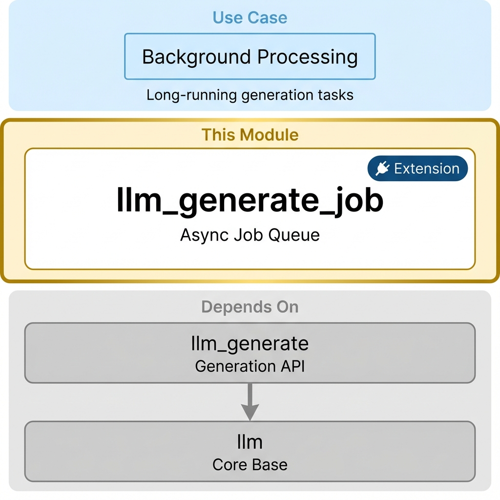

# LLM Transcribe Job

This module provides a comprehensive transcription job management system for LLM providers, extending the base LLM functionality with advanced queue management and job tracking capabilities.

**Module Type:** 🔌 Extension



## Installation

### What to Install

Install this module when you need **background/async transcription** for long-running tasks.

```bash
odoo-bin -d your_db -i llm_transcribe_job
```

### Auto-Installed Dependencies

These are pulled in automatically:

- `llm_transcribe` (transcription API)
- `llm_thread` (chat interface)
- `llm_tool` (tool framework)
- `llm` (core infrastructure)

### When to Use This Module

| Scenario                  | Recommendation                     |
| ------------------------- | ---------------------------------- |
| Quick chat responses      | Not needed - use direct transcription |
| Long document transcription  | **Install this**                   |
| Batch audio transcription    | **Install this**                   |
| API rate limit management | **Install this**                   |

### Common Setups Using This Module

| I want to...               | Install                                             |
| -------------------------- | --------------------------------------------------- |
| Background audio transcription | `llm_assistant` + `llm_openai` + `llm_transcribe_job` |
| Batch audio processing     | `llm_assistant` + `llm_fal_ai` + `llm_transcribe_job` |
| Queue management dashboard | `llm_transcribe_job` (adds admin views)               |

## Features

### Transcription Job Management

- **Job Lifecycle**: Complete job lifecycle management from creation to completion
- **Status Tracking**: Real-time job status monitoring (draft, queued, running, completed, failed, cancelled)
- **Retry Logic**: Automatic and manual retry capabilities for failed jobs
- **Error Handling**: Comprehensive error tracking and reporting

### Queue Management

- **Provider-specific Queues**: Each LLM provider has its own dedicated queue
- **Concurrent Job Control**: Configurable maximum concurrent jobs per provider
- **Queue Health Monitoring**: Real-time queue health indicators (healthy, warning, critical)
- **Performance Metrics**: Queue performance analytics and success rates

### Flexible Transcription Options

- **Direct Transcription**: Traditional immediate transcription (backward compatible)
- **Queued Transcription**: Advanced queue-based transcription for better resource management
- **Auto-detection**: Intelligent choice between direct and queued transcription based on provider capabilities

### Monitoring and Analytics

- **Job Statistics**: Comprehensive job statistics and performance metrics
- **Queue Analytics**: Queue performance monitoring and capacity planning
- **Success Rate Tracking**: Success rate monitoring across providers and time periods
- **Duration Tracking**: Queue time and processing time analytics

## Architecture

### Models

#### `llm.transcription.job`

The main model for managing individual transcription jobs:

- **Relationships**: Links to thread, provider, model, and messages
- **Status Management**: Job state transitions and lifecycle management
- **Timing**: Queue time, processing time, and completion tracking
- **Retry Logic**: Configurable retry attempts and error handling

#### `llm.transcription.queue`

Provider-specific queue management:

- **Configuration**: Maximum concurrent jobs, auto-retry settings
- **Monitoring**: Real-time job counts and queue health
- **Performance**: Success rates and processing time analytics
- **Actions**: Queue processing, job retries, and maintenance

### Thread Integration

Extends `llm.thread` with:

- **Transcription Options**: `transcribe_response()` method with `use_queue` parameter
- **Job Tracking**: Links to all transcription jobs for the thread
- **Status Monitoring**: Real-time transcription status and progress
- **Statistics**: Thread-level transcription analytics

### Provider Integration

Extends `llm.provider` with:

- **Job Creation**: `create_transcription_job()` method
- **Status Checking**: `check_transcription_job_status()` method
- **Job Cancellation**: `cancel_transcription_job()` method
- **Queue Information**: `get_transcription_queue_info()` method

## Usage

### Basic Usage

```python
# When the thread uses a transcription model, queueing is automatic
thread = self.env['llm.thread'].browse(thread_id)
user_message = thread.message_post(
    body="Please transcribe the attached audio.",
    llm_role="user",
    body_json={"attachment_ids": [attachment_id]},
)

for update in thread.generate_messages(user_message):
    print(update)
```

### Queue Management

```python
# Get or create queue for a transcription model
queue = self.env['llm.transcription.queue']._get_or_create_queue(model_id)

# Process pending jobs
processed_count = queue._process_model_queue(queue.model_id)

# Check queue health
stats = queue.get_queue_stats()
```

### Job Management

```python
# Create a job
job = self.env['llm.transcription.job'].create({
    'thread_id': thread_id,
    'provider_id': provider_id,
    'model_id': model_id,
    'transcription_inputs': {'prompt': 'Hello world'},
})

# Queue and start the job
job.action_queue()

# Monitor job status
while job.state in ['queued', 'running']:
    status = job.check_status()
    print(f"Job {job.id} is {job.state}")
```

## Configuration

### Queue Configuration

Each provider queue can be configured with:

- **Max Concurrent Jobs**: Maximum number of simultaneous jobs
- **Auto Retry**: Automatic retry of failed jobs
- **Retry Delay**: Time to wait before retrying failed jobs

### Job Configuration

Jobs support:

- **Max Retries**: Maximum number of retry attempts
- **Transcription Inputs**: Custom inputs for the transcription process
- **Provider Data**: Provider-specific configuration and metadata

## Monitoring

### Queue Health

Queues are automatically monitored for:

- **Healthy**: Normal operation
- **Warning**: High load but functioning
- **Critical**: Overloaded or failing
- **Disabled**: Manually disabled

### Performance Metrics

- **Average Queue Time**: Time jobs spend waiting
- **Average Processing Time**: Time jobs spend processing
- **Success Rate**: Percentage of successful jobs
- **Throughput**: Jobs processed per time period

## Administration

### Views

- **Transcription Jobs**: List and manage all transcription jobs
- **Transcription Queues**: Monitor and configure provider queues
- **Queue Dashboard**: Real-time queue monitoring

### Cron Jobs

- **Process Queues**: Automatically process pending jobs (every minute)
- **Check Job Status**: Update running job statuses (every 30 seconds)
- **Auto-retry Failed Jobs**: Retry eligible failed jobs (every 5 minutes)
- **Cleanup Old Jobs**: Remove old completed jobs (daily)

## Provider Implementation

To implement transcription job support in a provider:

```python
class MyProvider(models.Model):
    _inherit = 'llm.provider'

    def create_transcription_job(self, job_record):
        # Create job with external provider
        external_job_id = self.my_api.create_job(
            job_record.transcription_inputs
        )
        return external_job_id

    def check_transcription_job_status(self, job_record):
        # Check job status with external provider
        status = self.my_api.get_job_status(job_record.external_job_id)

        if status['completed']:
            # Create result message
            message = job_record.thread_id.message_post(
                body=status['result'],
                llm_role='assistant',
                author_id=False,
            )
            return {
                'state': 'completed',
                'output_message_id': message.id,
            }
        elif status['failed']:
            return {
                'state': 'failed',
                'error_message': status['error'],
            }
        else:
            return {'state': 'running'}

    def cancel_transcription_job(self, job_record):
        # Cancel job with external provider
        return self.my_api.cancel_job(job_record.external_job_id)
```

## Migration from Direct Transcription

The module is fully backward compatible with direct transcription flows. To enable queue-based transcription, configure a queue for the model and let the system auto-detect it.

## Security

- **User Access**: Users can create and view their own transcription jobs
- **Manager Access**: LLM managers can view and manage all jobs and queues
- **Queue Management**: Only managers can configure and control queues

## Performance Considerations

- **Queue Processing**: Queues are processed every minute by default
- **Status Checking**: Job statuses are checked every 30 seconds
- **Cleanup**: Old jobs are automatically cleaned up after 7 days
- **Concurrent Jobs**: Configure max concurrent jobs based on provider limits

## Dependencies

- `llm_thread`: Core thread functionality
- `llm_tool`: Tool system integration
- `web_json_editor`: JSON field editing (optional)
